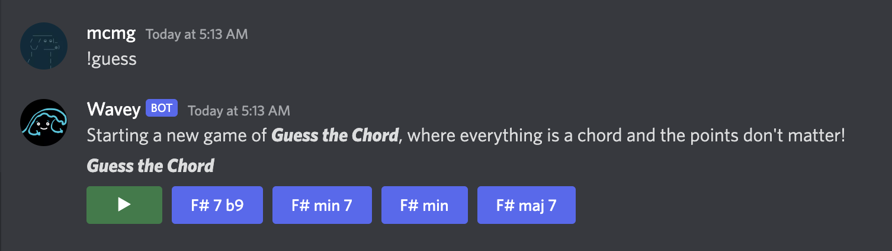
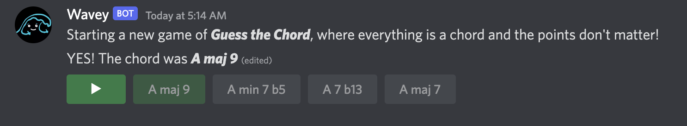
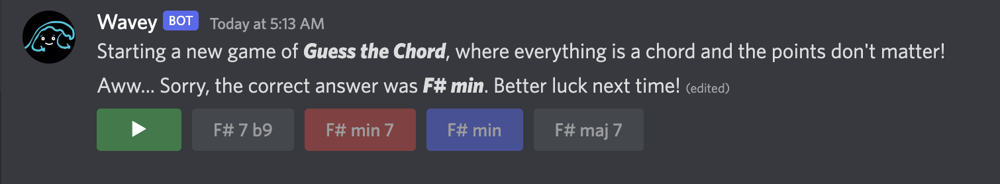
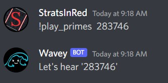
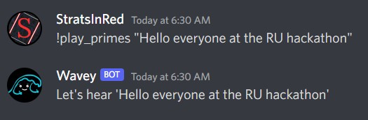
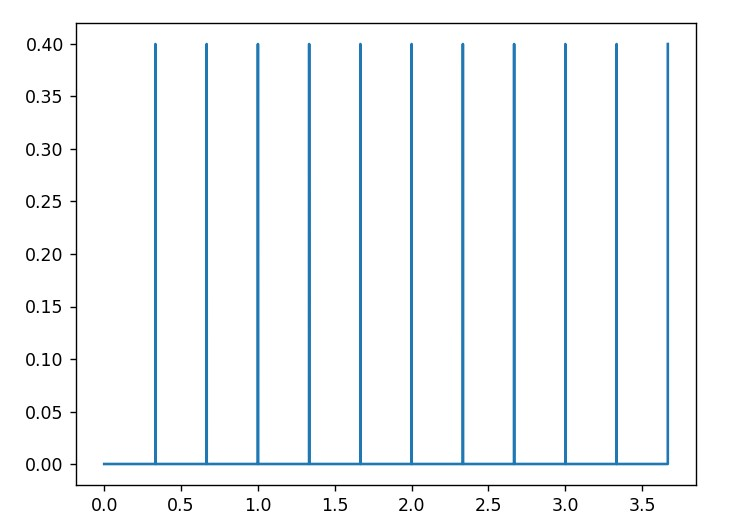

# Wavey
A discord bot specializing in interactive audio experiences!  

  
As of the current version, "interactive audio experiences"   are mostly limited to generating and playing .WAV files.   
That's OK, Wavey. We're still proud of you.

***
## Features
### Ear Training
Train your ears on 19 types of chords in 4 different keys —— that's right, 76 .WAV files, ripe for the picking!  
 

#### Examples
 
  
  
  

### Play Primes

Generate a sound based on a positive integer or a string. The generated sound is unique for every number and every string as it is based on the prime factorization of the integer or a map from the string to an integer. 

#### Examples
 
  
  

A underlying beat is also generated whose frequency corresponds to the number of primes in the prime factorization. The beat function looks like this: 

  

***

### Installation

[FFmpeg](https://ffmpeg.org/) is required for Wavey to stream audio in discord voice channels. Head on over to the [FFmpeg download page](https://ffmpeg.org/download.html) and select the installation for your operating system, or use a command line utility of your choice. [FFmpeg is on homebrew](https://formulae.brew.sh/formula/ffmpeg), [chocolatey](https://community.chocolatey.org/packages/ffmpeg) and [Linux package managers](https://trac.ffmpeg.org/wiki/CompilationGuide/Ubuntu).

***

### Documentation

#### Commands
+ `join` - Make Wavey join your current voice channel.
+ `leave` - Make Wavey leave your current voice channel.
+ `play_prime <optional: input_string>` - Synthesize audio from the input string (if none is provided, your username is used). Audio automatically plays in the current voice channel.
+ `chord` - Play a random chord in the current voice channel.

### References
- [nextcord](https://pypi.org/project/nextcord/) - A Python wrapper for the discord.js API. See the [documenation](https://docs.nextcord.dev/en/latest/api.html#).
- [ffmpeg](https://ffmpeg.org/) - A complete, cross-platform solution to record, convert and stream audio and video. Necessary for streaming audio in discord voice channels.
